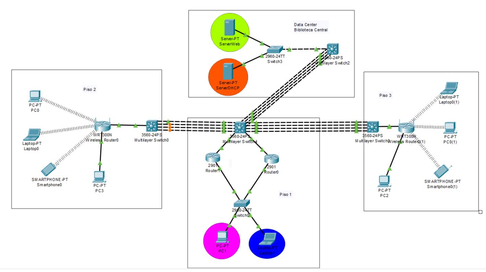

# TOPOLOGIA



# VLANS

| VLAN | Nombre         | Dirección IP      |
|------|----------------|-------------------|
| 13   | Admin          | 192.168.3.1/25    |
| 23   | Estudiantes    | 192.168.3.129/25  |
| 33   | Web Server     | 192.168.100.1/25  |
| 43   | DHCP Server    | 192.168.100.129/25|
# SERVIDOR DHCP

| Parámetro         | Valor              |
|-------------------|--------------------|
| IP del Servidor   | 192.168.100.130    |
| Default Gateway   | 192.168.100.129    |
| Máscara de Subred | 255.255.255.128    |

# PORTCHANEL

| PortChannel | Dirección IP 1 | Dirección IP 2 |
|-------------|----------------|----------------|
| 1           | 10.0.3.1/30    | 10.0.3.2/30    |
| 2           | 10.0.3.5/30    | 10.0.3.6/30    |
| 3           | 10.0.3.9/30    | 10.0.3.10/30   |


# CONFIGURACION DE PORTCHANEL CON LACP 

```
enable 
configure terminal 
interface rance fastEthertnet [rango]
channel-protocol lacp 
channel-group 1 mode active

exit

interface port-channel 1
no shwitchport
ip adress [ip]
exit

```